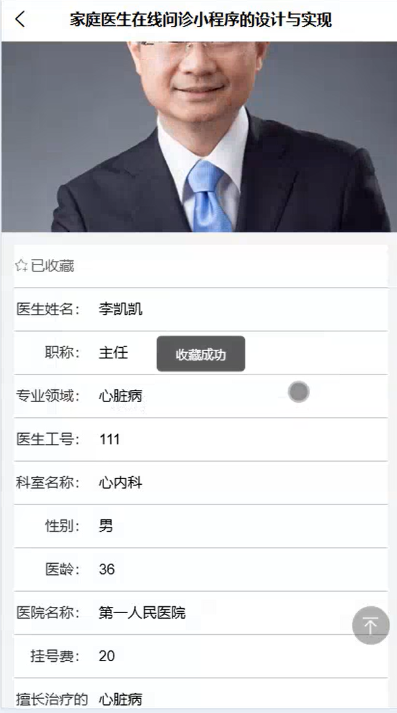
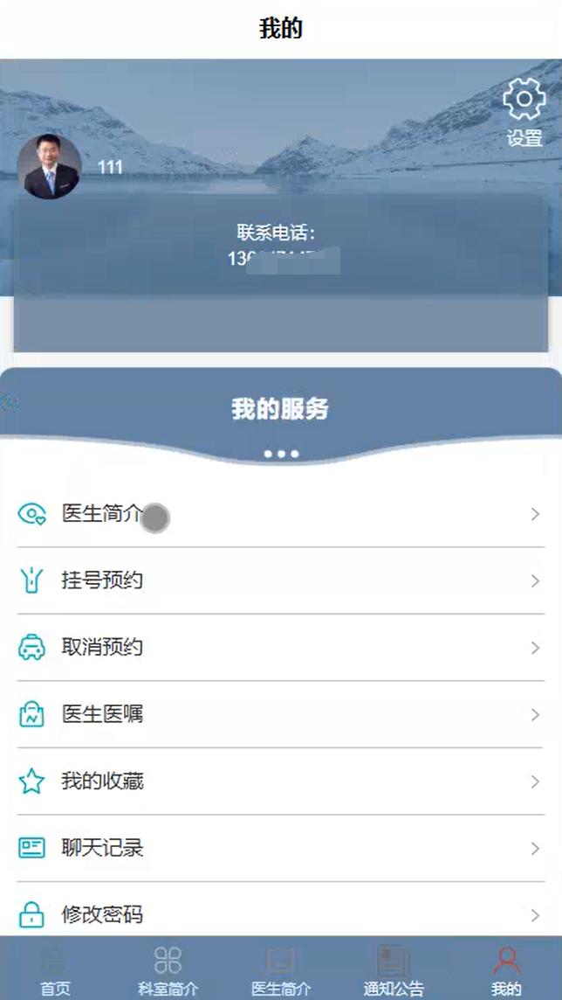
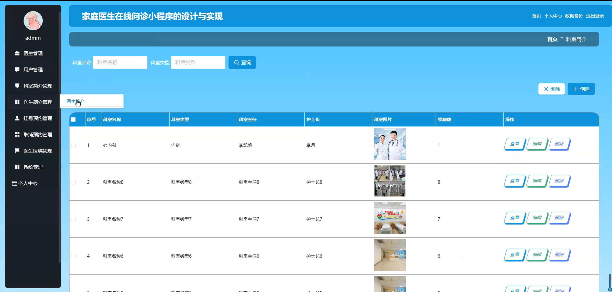
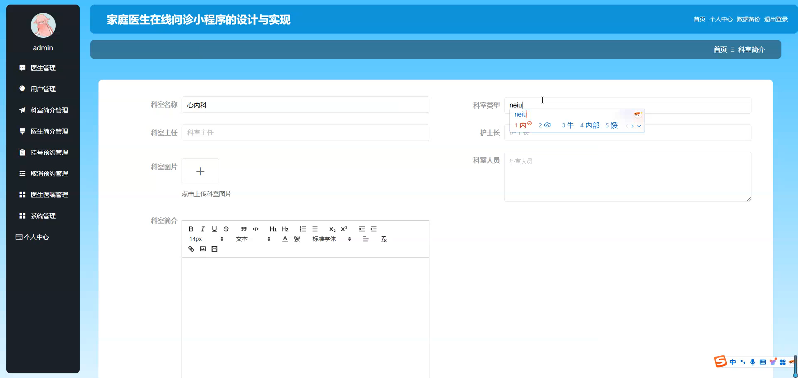
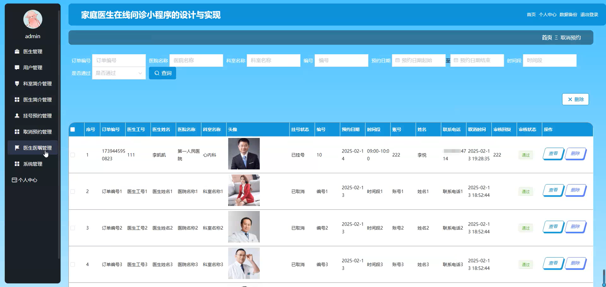
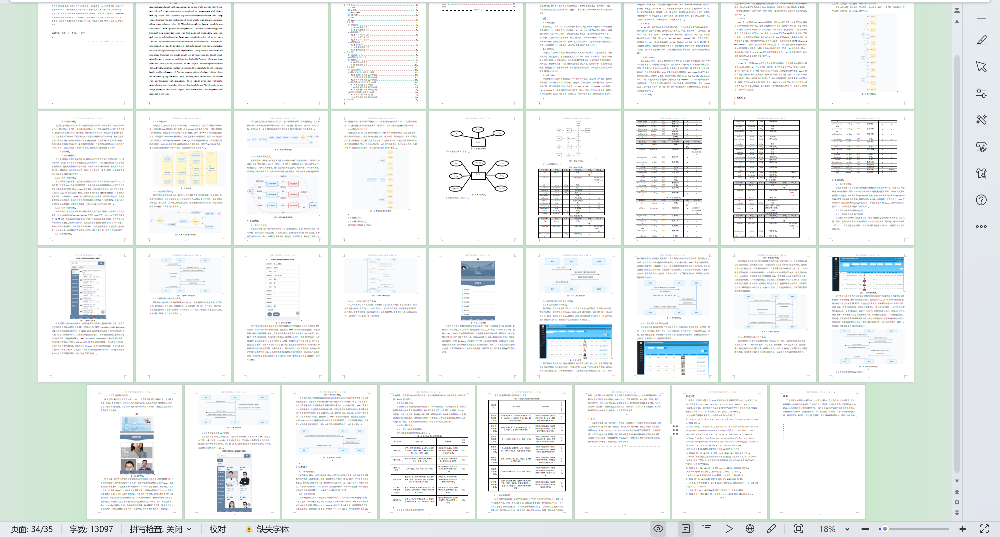

# mpweixinA221D
mpweixinA221D家庭医生在线问诊微信小程序+LW
 
## 源码问题查看主页咨询

### 一、关键词
科室简介管理，医生医嘱管理，挂号预约管理

### 二、作品包含
源码+数据库+万字设计文档+全套环境和工具资源+本地部署教程

### 三、项目技术
前端技术： Html、Css、Js、Vue2.0、Element-ui、uniapp
后端技术：Java、SpringBoot2.0、MyBatis

### 四、运行环境（以下版本亲测，其他版本兼容性请自行测试）
开发工具：IDEA/eclipse  + VSCODE + 微信开发者工具 + HBuilder X

数据库：MySQL5.7（最低要5.7版本）

数据库管理工具：Navicat10以上版本

环境配置软件： JDK1.8 + Maven3.6.3

前端Nodejs：14

浏览器：谷歌浏览器

### 五、项目介绍
项目编号：mpweixinA221D

家庭医生在线问诊小程序通过提供便捷的线上医疗服务，有效提升就医效率与体验，优化医疗资源配置。

角色：管理员、用户、医生

管理员功能：医生管理、用户管理、科室简介管理、医生简介管理、挂号预约管理、取消预约管理、医生医嘱管理、系统管理、个人中心。

用户功能:首页、科室简介、医生简介、通知公告、我的、挂号预约、取消预约、医生医嘱、我的收藏、诊室提醒、聊天记录、修改密码。

医生功能:首页、科室简介、医生简介、通知公告、我的、挂号预约、取消预约、医生医嘱、我的收藏、聊天记录、修改密码。

### 六、运行截图

